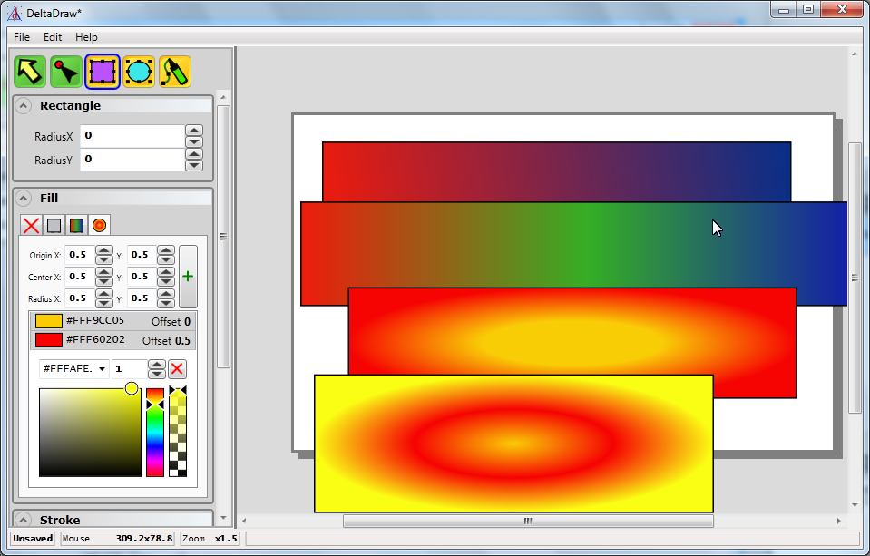

# Delta Draw

Final school project - vector drawing app made in C# WPF.

Probably the most valuable part is a custom-made color picker, with plenty of options. Also, you can copy the drawn shapes directly into XAML, that you can use in other stuff.

But it's a school project, so don't expect much.